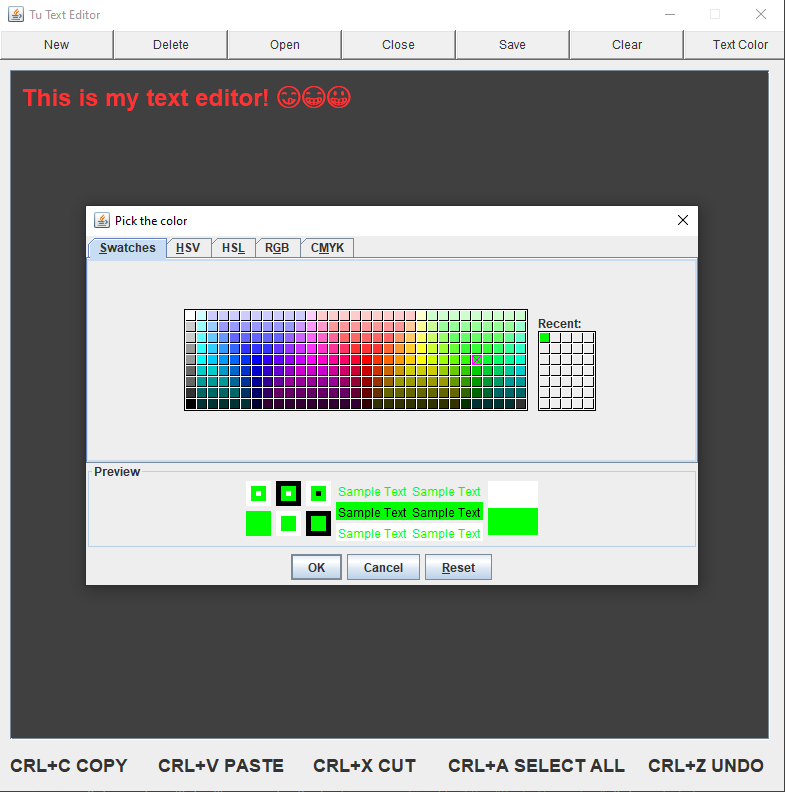

# TU-TextEditor-Java
A simple GUI version text-editor in Java, with save, open, write functionalities.\
future scope:- file delete, clear window, run file, etc
 
### Languages & tools :
[][java]
[][java]
  

|Text editor window| Text editor open file |Text editor font color|
|------|-------|-------|
||||

### Directory Structure :
    |-- TuTextEditor
    |    |-- out
    |    |-- src
    |    |   |-- com
    |    |       |-- text_editor
    |    |           |-- TextEditor.java
    |    |          
    |    |-- file.txt
    |    |
    |    |-- TuTextEditor.iml
    |
    |-- Img
    |    |-- intellij.png
    |    |-- java.png
    |    |-- TUtextEditor1.png
    |    |-- TUtextEditor2.png
    |    |-- TUtextEditor3.png

### Connect with me :  

  
 

[website]: https://abhilashtuofficial.github.io/
[java]: https://github.com/AbhilashTUofficial/java-programming
